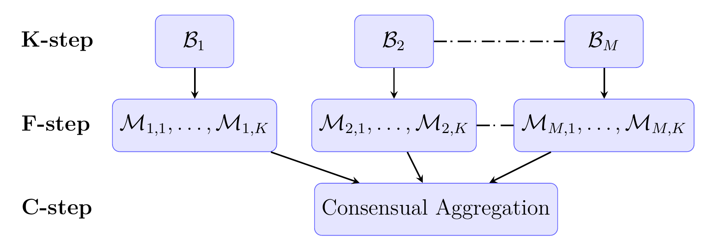

# KFC-Procedure

KFC procedure is a three-step machine learning method aim at constructing predictions in both classification and regression problems.
It is available in the journal of Statistical Computation and Simulation at the following link: [https://dx.doi.org/10.1080/00949655.2021.1891539](https://dx.doi.org/10.1080/00949655.2021.1891539).

--- 

## Summary

This proceudure consists of three steps:
- $K$-step ($K$-means step): $K$-means algorithm with $M$ Bregman divergences $\mathcal{B}=B_1, ... B_M$ are implemented, [see, for example, [Banerjee (2005)](https://jmlr.org/papers/v6/banerjee05b.html)]. According to the properties of Bregman divergences, we expect to break down the input data into $M$ different partitions structures, each of $K$ clusters, namely $P_1=(P_{11},...,P_{1K}), ..., P_M=(P_{M1},...,P_{MK})$.
- F-step (Fitting step): For each Bregman divergence $B_j$, we fit simple local models on the $K$ clusters: $P{j1},...,P_{jK}$, obtained in the previous step. The collection of these $K$ local models is called a candidate model (they should be simple such as Linear models for example) namely $M_j=(M_{j1},...,M_{jK})$. At the end of this step, we have $M$ candidate models corresponding to $M$ options of the Bregman divergences. To predict a new data point $x$ using the candidate model $M_j$, we first assign the point to the cluster with closest center using the corresponding Bregman divergence $B_j$, and the prediction is given by the corresponding local model on that cluster: $M_j(x)=M_{jk^{\star}}(x)$ where $M_{jk^{\star}}(x)$ is the local model built one the cluster $k^{\star}$ that contains $x$.
- C-step (Combining step): All the candidates models constructed in step F are combined using Consensual aggregation methods in this step. The combining estimation methods used in this step are available in my [AggregationMethods](https://github.com/hassothea/AggregationMethods) repository are:
   - [`KernelAggReg`](https://hassothea.github.io/files/CodesPhD/KernelAggReg.html) : A kernel-based consensual regression aggregation method (see [Has (2021)](https://hal.archives-ouvertes.fr/hal-02884333v5)).
   - [`MixCobraReg`](https://hassothea.github.io/files/CodesPhD/MixCobraReg.html) : Aggregation using input-output trade-off (see [Fischer and Mougeot (2019)](https://www.sciencedirect.com/science/article/pii/S0378375818302349)).
   - [`KernelAggClass`](https://hassothea.github.io/files/CodesPhD/KernelAggClass.html) : A kernel-based combined classification rule (see [Mojirsheibani (2000)](https://www.sciencedirect.com/science/article/pii/S0167715200000249)).
   - [`MixCobraClass`](https://hassothea.github.io/files/CodesPhD/MixCobraClass.html) : Aggregation using input-output trade-off (see [Fischer and Mougeot (2019)](https://www.sciencedirect.com/science/article/pii/S0378375818302349)).

The procedure provides the predictions of all the candiate models (step F) and the ones of the procedure (step C).

--- 

## &#128270; How to download & run the codes?

To run the codes, you can `clone` the repository directly or simply load the `R script` source files from this repository using [devtools](https://cran.r-project.org/web/packages/devtools/index.html) package in `Rstudio` as follows:

1. Install [devtools](https://cran.r-project.org/web/packages/devtools/index.html) package using command: `install.packages("devtools")`

2. Loading the source codes from `GitHub` repository using `source_url` function by: `devtools::source_url("https://raw.githubusercontent.com/hassothea/KFC-Procedure/master/file.R")`

where `file.R` is the file name contained in this repository which you want to import into your `Rstudio`.

---

## &#128214; Documentation

The documentation and explanation of the methods are available on my webpage as listed below:

- `KFCReg` : see [KFCReg documentation](https://hassothea.github.io/files/CodesPhD/KFCReg.html).

----
